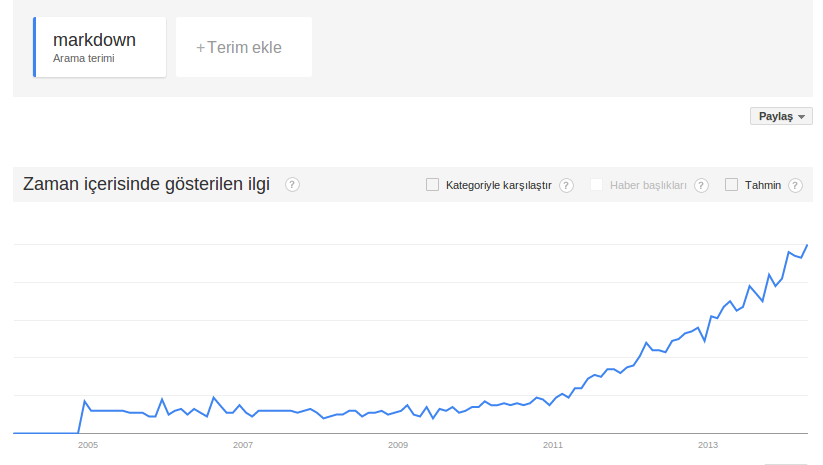

#   Markdown

.fx: first

***1zinnur9*** `<zinnuryesilyurt@gmail.com>`

***gzdsvnc*** `<gozde.sevinc@bil.omu.edu.tr>`

*GOOOOOOOD MORNING VIETNAAAAAMMMM!!!*


---

##    Markdown Nedir ? Yenir mi ? İçilir mi?

-   Bir işaretleme dili

-   Daha çok `Lightweight Markup Language` yani hafifsiklet işaretleme dili

-   Uzun uzun html etiketlerinden kurtulmak için birebir

-   Sizin yerinize html dosyası üretir

-   `John Gruber` ve `Aaron Swartz`'ın ortak ürünüdür 

---

##    Markdown Nedir ? Yenir mi ? İçilir mi?

-   Yayınlanacak bir yazı üzerinde çok değişiklik yapılması gerekir 

-   HTML publishing(yayın) formatı olduğu için hızlı değişiklikler ve eklemeler zordur

-   Markdown, plain text(düz yazı) yazarken bu yazıyı formatlı bir şekilde yazmayı sağlar

---

##    Markdown'a ilgi artıyor mu ?

-   Buna da artmıyor diyen varsa çıkışta görüşelim



---

##    Markdown Alternatifleri

-   Alternatifler için [buraya](http://en.wikipedia.org/wiki/Lightweight_markup_language) tıklayınız

---
##   Markdown Sözdizimi

###   Paragraflar

-   Paragraf için `<p></p>` şeklinde belirtmeye gerek yoktur

-   Öncesinde bir satır boşluk olan yazı bloğu paragraf olarak algılanır

###   Satır Sonları

-   Satır sonunda 2 SPACE bırakılmalıdır.

---

##   Markdown Sözdizimi

### Başlıklar

-   Markdown başlık olarak Setext ve ATX  stillerini destekler

-   Setext tarzı başlıklarda:

    +    Birinci düzey başlıklar için `=` ile başlığın altı çizilir

    +    İkinci düzey başlıklar için `-` işareti kullanarak altı çizilir

	`This is an H1`

	`============= (Birincil başlık)`

	`This is an H2`

	`-------------(İkincil başlık)`

-   Atx tarzı başlıklarda büyüklüklerine göre 1-6 arasında `#` konur
 
	`# This is an H1(Ana başlık)`

	`###### this is an H6(En alt başlık)`

---

##   Markdown Sözdizimi

###   Alıntılama

-   Markdown alıntılama için e-posta stili `>` karakterini kullanır
-   `> alıntı buradan başlar...` yapısı kullanılabilir 
-   İç içe alıntılar ilk alıntı bloğunun altında `>>` şeklinde yazılarak yapılabilir
-   Alıntılar, diğer markdown elemanlarını içerebilir

	`> This is the first level of quoting.`

	`>`

	`> > This is nested blockquote.`

	`>`

	`> Back to the first level.`

---


##   Markdown Sözdizimi

###   Listeler

-   Markdown sıralı(sayılı) ve sırasız (madde işaretli) listeleme yapar

-   Numaralandırılmamış listeler için `*, +, -` yapısı

	`+red`

	`*green`

	`-blue`

-   Numaralandırılmışlar için de 1.2.3. bla bla yapısı kullanılır

	`1.  Bird`

	`2.  McHale`

	`3.  Parish`

---

##   Markdown Sözdizimi

###   Kod Blokları

-   Bir satır 4 SPACE ya da 1 TAB içerden başladığında kod bloğu olur

-   Satır içi kod bloğu için ters tırnak(`) kullanılır

This is a normal paragraph:

    This is a code block.

***Dönüştürülmüş hali:***

`<p>This is a normal paragraph:</p>`

`<pre><code>This is a code block.`
`</code></pre>`

---

##   Markdown Sözdizimi

###   Yatay Çizgiler

-   Html de kullanılan `<hr></hr>` tagını markdown da belli bir hat üzerinde:

	*   Üç veya daha fazla `_` veya

	*   Üç veya daha fazla `*` çizerek yapıyoruz

`* * *`

`***`

`*****`

`_ _ _`

`_____________________________________`

---

##   Markdown Sözdizimi

###   Link

-   Markdown bağlantı eklerken 2 stili destekler; `Satır içi` veya `Referans`

-   Her iki stilde de bağlantının metinde gözükeceği şekli [] tarafından sınırlandırılır

-   Satır içi link verirken 

`[bağlantı ismi](Url "Tırnak içinde de isteğe bağlı başlık yazılır")`

`[an example](http://example.com/ "Title")`

`[This link](http://example.net/)`

Sonuçları:

`<a href="http://example.com/" title="Title">an example</a>`

`<a href="http://example.net/">This link</a>`

---

##   Markdown Sözdizimi

###   Link

-   Referans tipi linklerin kullanımı şöyledir

	`This is [an example][id]`

-   Düzenleme kolaylığı için de id ile belirtilen linkler sayfanın en altında listelenir

	`[id]: http://example.com/`

###   Otomatik Link

-   `<` `/>` arasında link verilerek otomatik link verilebilir

	`<http://example.com/>`

---

##   Markdown Sözdizimi

###   Vurgulama

-   Bir kelimeyi vurgulamak için genelde `*vurgu*` veya `_vuruyoruz_` yazılır

-   Yani bir kelimenin etrafına `*` veya `_` işaretleri koyulur

	`*single asterisks*`

	`_single underscores_`

	`**double asterisks**`

	`__double underscores__`

Üretilmesi gereken:

`<em>single asterisks</em>`

`<em>single underscores</em>`

`<strong>double asterisks</strong>`

`<strong>double underscores</strong>`

---

##   Markdown Sözdizimi

###   Resim Ekleme

-  Resim eklerken bağlantılardaki gibi iki stil var: `Satır içi` ve `Referans`

	Satır içi:

	``

	Referans:
	
	`![Alt text][id]`

	`[id]: url/to/image  "Optional title attribute"`

---

##   Markdown Sözdizimi

###   Escape Karakterleri 

-   Noktalama işaretlerini sözdizimi aracı değil de kendi anlamlarıyla kullanmak için `\` kullanılır

	| Escape Karakterleri |                         |
	|---------------------|-------------------------|
	| `\ backslash`       | `+ plus sign`		|
	| `* asterisk`        | `- minus sign (hyphen)` |
	| `_ underscore`      | `. dot`			|
	| `{} curly braces`   | `! exclamation mark`	|
	| `[] square brackets`| `() parentheses`	|
	| `# hash mark `      | ` bactick		|

---

##   Sözdiziminde Karşılaşılan Sorunlar

-    İç içe listeler birden fazla paragraf içeriyorsa:

     + İç içe liste:
        -     dört boşluk dikkat.
         	*     sekiz boşluk.
		      bla bla bla bla bla bla bla bla bla bla bla bla bla
         	      bla bla bla bla bla bla bla bla bla bla bla bla bla
           
      	        bla bla bla bla bla bla bla bla bla bla bla bla bla bla 
		bla bla bla bla bla bla bla bla bla bla bla bla 


                *     bla bla bla bla bla bla bla bla bla bla bla bla bla
		      bla bla bla bla bla bla bla bla bla bla bla bla bla
    
     +    birden çok paragraf:
	  bla bla bla bla bla bla bla bla bla bla bla bla bla bla bla
          bla bla bla  bla bla bla bla bla bla bla bla bla bla bla 

---

##   Sözdiziminde Karşılaşılan Sorunlar 

-   Bir liste öğesi içine bir  alıntı eklemek için `>`konulmalı
 
	`*   Liste içinde alıntı:`

    	`> Bu liste içinde`
    	`> bir alıntıdır`

	*   Liste içinde alıntı:

    	> Bu liste içinde
    	> bir alıntıdır

-   Bir liste öğesi içine bir kod bloğu koymak için,  8 boşluk veya 2 tab girinti konmalı

	`*   Liste içinde kod bloğu:`

	`<kod burada>`

	 *   liste ile kod bloğu:

        	<kod burada>
---

##   Sözdiziminde Karşılaşılan Sorunlar 

-   Kod blokları içersinde parse işlemi yapılmaz
-   Bu nedenle istenen karakter escape edilmeden yazılabilir.
-   Vurgu yazmak için, `*vurgu*` yazmaya gerek yok.

---

##   Markdown Lehçeleri

-   Her dilin bir lehçesi, ağzı vardır

-   Bazı lehçeler ve yazıldıkları diller: 

	*   Markdown.pl -> `Perl`
	*   Github Flovered Markdown -> `Node.js`
	*   MultiMarkdown -> `Perl`
	*   Pandoc -> `Haskell`
	*   Kramdown -> `Ruby`
	*   Sundown -> `C`
	*   Redcarpet -> `Ruby`
	*   Black Friday -> `Go`
	*   Discount -> `C`
	*   Misaka -> `Python`

--- 

##   Markdown Lehçeleri

-   Markdown lehçelerinin bir listesini görebilmek için [tıklayın](http://www.w3.org/community/markdown/wiki/MarkdownImplementations)

-   Markdown lehçelerinin aralarındaki farkları görebilmek ve test edebilmek için [tıklayın](http://johnmacfarlane.net/babelmark2/)

---

##   Markdown Sözdizimi Renklendirmesi

Kramdown, Github Flavored Markdown, Black Friday
:   
     \` ```ruby`

	`require 'redcarpet'`

	`markdown = Redcarpet.new("Hello World!")`

	`puts markdown.to_html`

     \` ``` `

Pandoc
:   
	`~~~~ {#mycode .haskell .numberLines startFrom="100"}`

	`qsort []     = []`

	`qsort (x:xs) = qsort (filter (< x) xs) ++ [x] ++`

		       `qsort (filter (>= x) xs)`
	`~~~~~~~~~~~~~~~~~~~~~~~~~~~~~~~~~~~~~~~~~~~~~~~~~`

---

##   Markdown Tablo Oluşturma

###   Maruku'da Tablo Oluşturma

`First Header  | Second Header`

`------------- | -------------`

`Content Cell  | Content Cell`

`Content Cell  | Content Cell`


First Header  | Second Header
------------- | -------------
Content Cell  | Content Cell
Content Cell  | Content Cell


---

##   Markdown Tablo Oluşturma

###   Kramdown'da Tablo Oluşturma

`| Header1 | Header2 | Header3 |`                               

`|:--------|:-------:|--------:|`

`| cell1   | cell2   | cell3   |`

`| cell4   | cell5   | cell6   |`

| Header1 | Header2 | Header3 |
|:--------|:-------:|--------:|
| cell1   | cell2   | cell3   |
| cell4   | cell5   | cell6   |


---

##   Markdown Tablo Oluşturma

###   Pandoc'da Tablo Oluşturma

`| Right | Left | Default | Center |`

`|------:|:-----|---------|:------:|`

`|   12  |  12  |    12   |    12  |`

`|  123  |  123 |   123   |   123  |`

`|    1  |    1 |     1   |     1  |`


| Right | Left | Default | Center |
|------:|:-----|---------|:------:|
|   12  |  12  |    12   |    12  |
|  123  |  123 |   123   |   123  |
|    1  |    1 |     1   |     1  |


---

##   Markdown Tablo Oluşturma

### Github Flavor Markdown'da Tablo Oluşturma

`Markdown | Less | Pretty`

`--- | --- | ---`

`*Still* | `renders` | **nicely**`

`1 | 2 | 3`

Markdown | Less | Pretty
--- | --- | ---
*Still* | `renders` | **nicely**
1 | 2 | 3

---


##   Markdown'dan PDF'e Dönüşelim

-   Markdown dosyanızı pdf'e çevirmenin bir kaç yolu var:

	*   md2pdf ruby gemleri

	*   Pandoc'un bir aracı

	*   markdown-pdf aracı

	*   Ve sizin de yazabileceğiniz bir sürü araç

-   Bunların kullanımı:

	*   md2pdf gemi için

	    +   `$gem install md2pdf`

	*   Pandoc için

	    +   `$pandoc -t beamer -o output.pdf yourInput.mkd`

	    +   Ancak Latex Beamer yüklü olmalı

		-   `$sudo apt-get install latex-beamer`

---

##   Markdown'dan PDF'e Dönüşelim

*   markdown-pdf aracı

	+   `npm install markdown-pdf`

[Github Reposu](https://github.com/alanshaw/markdown-pdf)

---

##   Redcarpet Gemi ile Markdown işleyici

[İşleyicinin Github Reposu İçin Bir Tık Alalım](https://github.com/1zinnur9/markdown_interpreter)

---

## Var mı bi sıkıntı ?

*** Yayında ve yapımda emeği geçen @1zinnur9 ve @gzdsvnc'ye teşekkürler :)***


	


